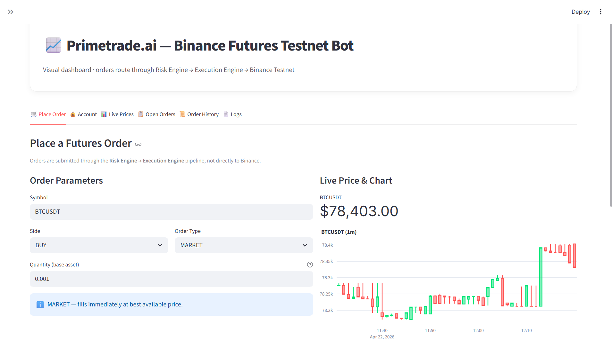
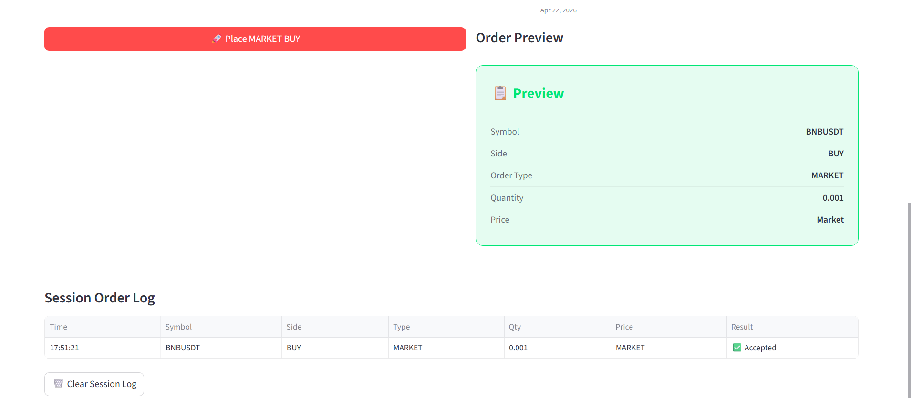
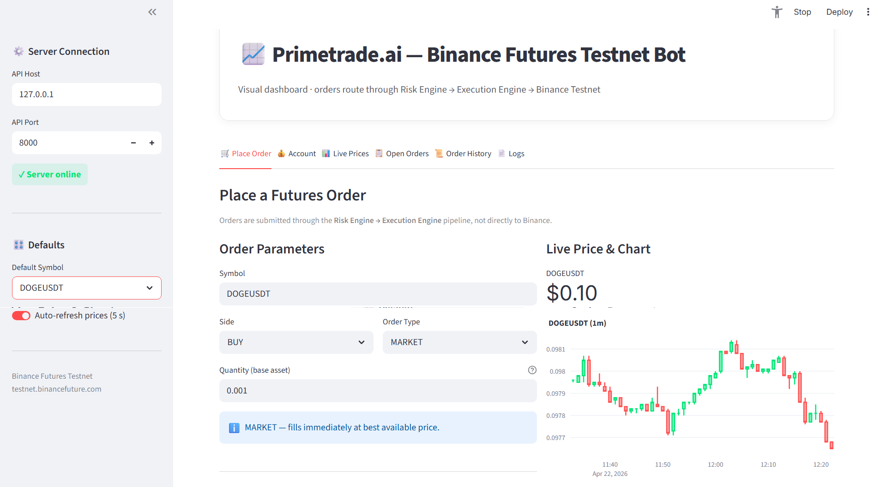
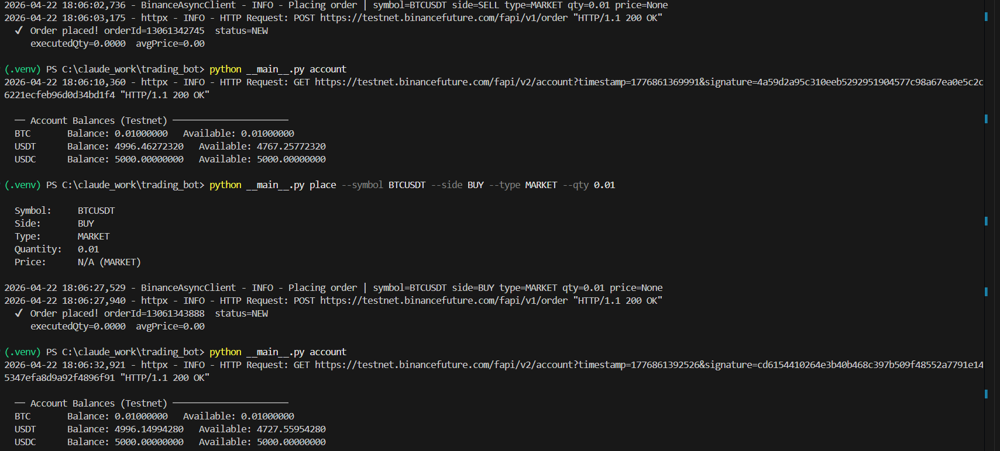

# Quant Trading System (Binance Futures Testnet)

Author: Aayush Dubey  
Role Applied: Python Developer Intern - Primetrade.ai

An async, event-driven trading system built with FastAPI for Binance USDT-M Futures Testnet.

## What This Project Does

- Streams live market data from Binance websocket ticker streams.
- Generates strategy signals (mean reversion + momentum).
- Validates signals with risk rules.
- Executes valid orders via Binance REST API.
- Persists filled orders in SQLite.
- Exposes HTTP endpoints for account, positions, manual orders, and recent orders.

## Current Architecture

```text
trading_bot/
├── __main__.py
├── README.md
├── project_structure.md
├── requirements.txt
├── Dockerfile
├── .env.example
├── agents/
├── bot/
│   ├── api/                # FastAPI app + routes
│   ├── backtest/           # Historical replay engine
│   ├── cli/                # CLI entrypoint (serve command)
│   ├── client/             # Binance async REST client
│   ├── core/               # Config, event bus, models, DB, logging
│   ├── data/               # Websocket + in-memory orderbook
│   ├── execution/          # Order execution engine
│   ├── risk/               # Risk engine
│   └── strategy/           # Strategy implementations
└── tests/
    ├── test_api.py
    └── test_risk.py
```

## Setup

1. Clone and enter project:

```bash
cd trading_bot
```

2. Create and activate virtual environment:

```bash
python -m venv .venv

# Windows (PowerShell)
.venv\Scripts\Activate.ps1

# Windows (cmd)
.venv\Scripts\activate

# macOS/Linux
source .venv/bin/activate
```

3. Install dependencies:

```bash
pip install -r requirements.txt
```

4. Configure credentials:

```bash
# Windows (PowerShell)
$env:BINANCE_TESTNET_API_KEY="your_api_key_here"
$env:BINANCE_TESTNET_API_SECRET="your_api_secret_here"

# macOS/Linux
export BINANCE_TESTNET_API_KEY="your_api_key_here"
export BINANCE_TESTNET_API_SECRET="your_api_secret_here"
```

You can also create a local .env file from .env.example.

## Run The App

The application consists of a backend API server and a frontend Streamlit dashboard.

### 1. Start the API Server

Run the following command from the project root to start the backend server:

```bash
python __main__.py serve --host 127.0.0.1 --port 8000
```

When running successfully, the API is available at:

- http://127.0.0.1:8000
- Swagger docs: http://127.0.0.1:8000/docs

### 2. Start the Dashboard

In a new terminal window (with your virtual environment activated), start the visual dashboard:

```bash
python -m streamlit run dashboard.py
```

This will automatically open the dashboard in your browser (typically at http://localhost:8501), where you can monitor live prices, view the candlestick chart, and place orders through the risk/execution pipeline.

### 3. Using the CLI

If you prefer to test manually without the dashboard, you can use the built-in CLI:

- **Check Account Balance**: `python __main__.py account`
- **Place Market Buy**: `python __main__.py place --symbol BTCUSDT --side BUY --type MARKET --qty 0.01`
- **Place Market Sell**: `python __main__.py place --symbol BTCUSDT --side SELL --type MARKET --qty 0.01`
- **Place Limit Order**: `python __main__.py place --symbol BTCUSDT --side BUY --type LIMIT --qty 0.01 --price 60000`

## Screenshots & Demos

**Streamlit Dashboard:**


**CLI - Account Balance:**


**CLI - Market Buy:**


**CLI - Market Sell:**


**CLI - Limit Order:**


## API Usage Examples

Get account snapshot:

```bash
curl http://127.0.0.1:8000/account
```

Get only open positions:

```bash
curl http://127.0.0.1:8000/positions
```

Publish a manual signal/order request:

```bash
curl -X POST http://127.0.0.1:8000/order \
  -H "Content-Type: application/json" \
  -d '{"symbol":"BTCUSDT","side":"BUY","type":"MARKET","quantity":0.01}'
```

Get recent persisted orders:

```bash
curl http://127.0.0.1:8000/orders
```

## Event Pipeline

```text
WebSocket MARKET_DATA
  -> Strategy SIGNAL
  -> Risk ORDER_REQUEST
  -> Execution ORDER_FILLED/ERROR
  -> Database persistence
```

## Run Tests

```bash
python -m pytest -q
```

or run specific tests:

```bash
python -m pytest -q tests/test_api.py tests/test_risk.py
```

## Logging

- Console logging follows configured log level.
- Rotating JSON logs are written to logs/trading_bot.json.
- Uvicorn logs are integrated into the same logging config.

## Important Notes

1. Testnet only: default base URL is https://testnet.binancefuture.com.
2. Signed endpoints require valid API key and secret.
3. Risk engine currently enforces quantity and max position-size checks.
4. If you change event payload structure, update strategy, risk, execution, and DB parsing together.
