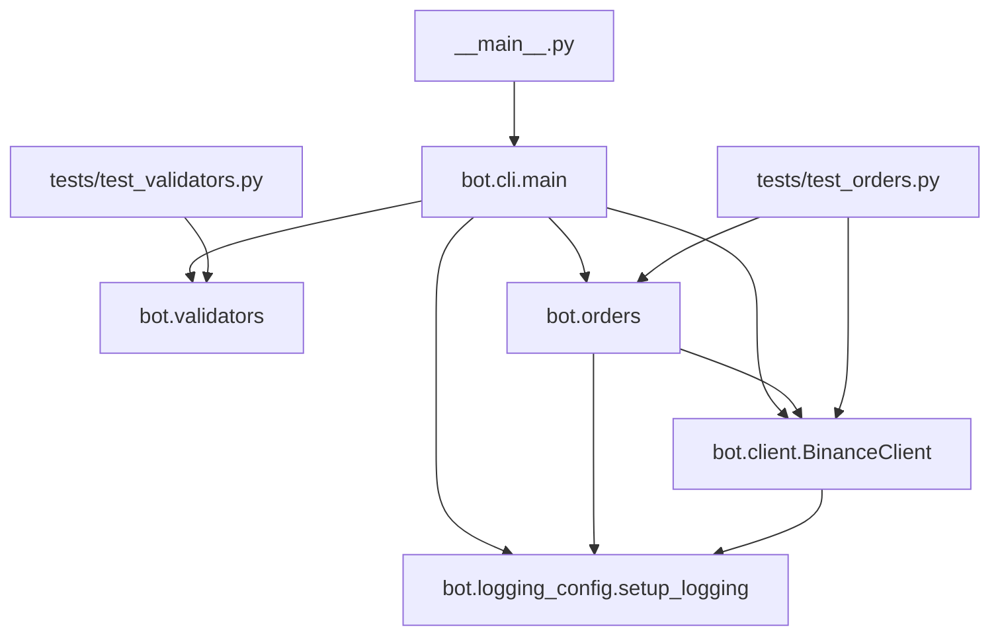

# Project Structure

This document is a compact repository map for the Binance Futures Testnet Trading Bot. It is intended to help a coding agent understand the codebase quickly without rereading every file from scratch.

## High-Level Purpose

The project is a Python CLI application for placing Binance USDT-M Futures Testnet orders and viewing account balances. It supports `MARKET`, `LIMIT`, and `STOP_MARKET` order types, validates inputs locally, signs API requests, retries transient failures, and logs activity to rotating files.

## Repository Map

```text
trading_bot/
├── .env.example
├── __main__.py
├── README.md
├── requirements.txt
├── bot/
│   ├── __init__.py
│   ├── cli.py
│   ├── client.py
│   ├── logging_config.py
│   ├── orders.py
│   └── validators.py
├── logs/
│   ├── limit_order_sample.log
│   └── market_order_sample.log
└── tests/
    ├── test_orders.py
    └── test_validators.py
```

## Execution Flow

The runtime path is:

1. `__main__.py` imports and runs `bot.cli.main()`.
2. `bot.cli` parses command-line arguments with `argparse`.
3. `bot.validators.validate_all()` normalizes and validates symbol, side, order type, quantity, and price.
4. `bot.orders.place_order()` converts validated input into a higher-level order flow.
5. `bot.client.BinanceClient` signs and sends HTTP requests to the Binance Futures Testnet.
6. `bot.logging_config.setup_logging()` configures rotating file logging and console warnings.

## Dependency Graph



## File-by-File Notes

### `.env.example`

Template for local credentials. It documents the two environment variables used by the client:

- `BINANCE_TESTNET_API_KEY`
- `BINANCE_TESTNET_API_SECRET`

It warns not to commit real secrets.

### `__main__.py`

Package entry point for `python -m trading_bot`-style execution. It simply imports `main` from `bot.cli` and runs it.

### `README.md`

User-facing setup and usage guide. It covers:

- Project purpose and CLI examples.
- Environment variable setup for Windows, macOS, and Linux.
- Order placement examples for `MARKET`, `LIMIT`, and `STOP_MARKET`.
- Account balance lookup.
- Logging behavior and sample output.
- Validation and error-handling expectations.
- Design decisions and assumptions.

Important detail: the README describes the project as a testnet-only Binance Futures bot and references `logs/trading_bot.log` as the active runtime log file.

### `requirements.txt`

Only two runtime dependencies are listed:

- `requests>=2.31.0`
- `urllib3>=2.0.0`

Everything else is standard library.

### `bot/__init__.py`

Package metadata only.

- `__version__ = "1.0.0"`
- `__author__ = "Aayush Dubey"`

### `bot/cli.py`

Command-line interface layer.

Responsibilities:

- Build the `argparse` parser.
- Accept global flags for API credentials and log level.
- Provide `place` and `account` subcommands.
- Render console output for order requests, order results, and account balances.
- Reinitialize logging with the chosen verbosity.

Main functions and behavior:

- `_supports_colour()` checks whether stdout is a TTY.
- `_c()` applies ANSI color codes when supported.
- `_print_order_request()` prints the normalized request summary.
- `_print_order_result()` prints success or failure formatting.
- `cmd_place()` validates input, places the order, and returns an exit code.
- `cmd_account()` fetches balances and prints funded assets only.
- `build_parser()` defines the CLI interface.
- `main()` wires parsing, logging setup, client creation, and dispatch.

Observed details:

- `place` requires `--symbol`, `--side`, `--type`, and `--qty`.
- `--price` is required for `LIMIT` and `STOP_MARKET` validation paths.
- Color helpers are intentionally lightweight and safe on Windows terminals that do not support ANSI codes.

### `bot/client.py`

Low-level Binance Futures Testnet REST client.

Responsibilities:

- Read API keys from arguments or environment variables.
- Build signed requests using HMAC-SHA256 and a millisecond timestamp.
- Retry transient failures using `requests` plus `urllib3.Retry`.
- Log outgoing request metadata and incoming response bodies.
- Raise a custom `BinanceAPIError` for API failures.

Important classes and functions:

- `BinanceAPIError` stores `status_code`, Binance `code`, and `msg`.
- `_build_session()` creates a `requests.Session` with retry behavior for common transient statuses and network failures.
- `BinanceClient.__init__()` initializes credentials, base URL, timeout, and session.
- `BinanceClient._sign()` appends timestamp and signature to signed requests.
- `BinanceClient._request()` performs HTTP I/O, JSON parsing, error conversion, and logging.
- `BinanceClient.place_order()` sends POST requests to `/fapi/v1/order`.
- `BinanceClient.get_exchange_info()` fetches `/fapi/v1/exchangeInfo`.
- `BinanceClient.get_account()` fetches `/fapi/v2/account`.

Endpoint constants:

- `TESTNET_BASE_URL = "https://testnet.binancefuture.com"`
- `EP_ORDER = "/fapi/v1/order"`
- `EP_EXCHANGE_INFO = "/fapi/v1/exchangeInfo"`
- `EP_ACCOUNT = "/fapi/v2/account"`

Behavior worth knowing:

- Missing credentials trigger a warning, not an immediate exception.
- Non-JSON responses are converted into `BinanceAPIError` with code `-1`.
- Any negative Binance `code` in JSON is treated as an error.
- Network connection problems become Python `ConnectionError`.
- Request timeouts become Python `TimeoutError`.

### `bot/logging_config.py`

Central logging setup.

Responsibilities:

- Create `logs/` if it does not exist.
- Configure a rotating file handler at `logs/trading_bot.log`.
- Configure a console handler that only emits warnings and above.
- Keep configuration idempotent through `_CONFIGURED`.

Key details:

- File handler level is `DEBUG`.
- Rotation is `5 MB` with `3` backups.
- Console handler level is `WARNING`.
- Formatter includes timestamp, level, logger name, and message.

### `bot/orders.py`

High-level order orchestration between CLI input and the raw client.

Responsibilities:

- Call `BinanceClient.place_order()` with normalized parameters.
- Convert raw response dicts into a structured `OrderResult` dataclass.
- Translate exceptions into a failure result instead of raising them to the CLI.
- Log the order lifecycle.

Important pieces:

- `OrderResult` captures `success`, order metadata, and `error_msg`.
- `OrderResult.from_response()` maps Binance response keys into a normalized object.
- `OrderResult.from_error()` creates a failure object.
- `place_order()` handles `MARKET`, `LIMIT`, and `STOP_MARKET` request shaping.

Behavior worth knowing:

- `LIMIT` orders get `time_in_force = "GTC"`.
- `STOP_MARKET` orders pass `stop_price`.
- Binance, network, timeout, and unexpected exceptions are all converted into a failure `OrderResult`.

### `bot/validators.py`

Pure validation layer with no external dependencies.

Constants:

- `VALID_SIDES = {"BUY", "SELL"}`
- `VALID_ORDER_TYPES = {"MARKET", "LIMIT", "STOP_MARKET"}`
- `SYMBOL_RE = r"^[A-Z]{2,20}USDT$"`

Functions:

- `validate_symbol()` uppercases and validates USDT-margined symbols.
- `validate_side()` accepts only `BUY` or `SELL`.
- `validate_order_type()` accepts only supported order types.
- `validate_quantity()` ensures positive decimal input.
- `validate_price()` enforces price rules by order type.
- `validate_all()` runs every validator and returns a normalized dict.

Behavior worth knowing:

- `MARKET` orders ignore `price` if provided.
- `LIMIT` orders require a positive price.
- `STOP_MARKET` orders also require a positive price, but it is semantically treated as a stop price.
- All failures raise `ValueError` with human-readable messages.

### `tests/test_orders.py`

Stdlib `unittest` tests for the order layer.

Coverage includes:

- Successful `MARKET` order handling.
- Successful `LIMIT` order handling.
- Binance API error conversion.
- Network error conversion.
- Timeout error conversion.
- Unexpected exception conversion.
- `OrderResult.from_response()` and `OrderResult.from_error()` behavior.

Implementation note:

- `MagicMock` is used to isolate `place_order()` from real network calls.

### `tests/test_validators.py`

Stdlib `unittest` tests for pure input validation.

Coverage includes:

- Symbol validation and normalization.
- Side validation and normalization.
- Order type validation.
- Quantity validation for positive decimal values.
- Price validation rules for `LIMIT`, `MARKET`, and `STOP_MARKET`.
- `validate_all()` integration behavior.

## Runtime Configuration

The project expects either environment variables or CLI flags for credentials.

Environment variables:

- `BINANCE_TESTNET_API_KEY`
- `BINANCE_TESTNET_API_SECRET`

CLI alternatives:

- `--api-key`
- `--api-secret`

Other runtime flag:

- `--log-level` controls the logger level passed into `setup_logging()`.

## What Another Agent Should Know First

1. The project is already split into a clean layered design: CLI, validation, orchestration, client, and logging.
2. The current implementation is testnet-only and hardcodes the Binance Futures testnet base URL.
3. Validation happens before network calls, so most malformed input should fail locally with `ValueError`.
4. The logging layer is central to the code path and gets initialized from import time in several modules.
5. The tests focus on the pure validator layer and the order orchestration layer, not on live HTTP calls.

## Practical Notes For Next Work

- If you change request/response shape in `bot/client.py`, update `bot/orders.py` and the order tests together.
- If you add a new order type, update `bot/validators.py`, `bot/orders.py`, CLI help text, and likely the README examples.
- If you alter logging behavior, check both the runtime logs and any expectations in the README.
- If you add new modules, extend the Mermaid graph here so the repo map stays current.
