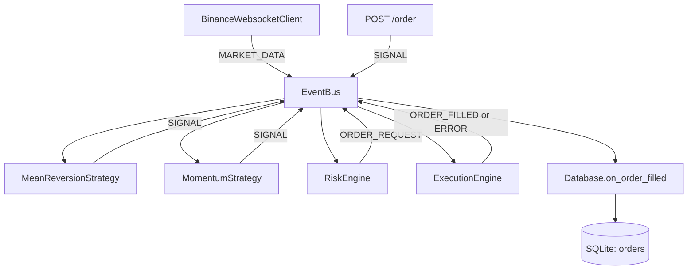

# Project Structure

This document maps the current repository layout and runtime behavior of the Quant Trading System in this project.

## High-Level Purpose

The project is an event-driven, async Python trading system for Binance Futures Testnet. It provides:

- A CLI entrypoint to start a FastAPI service.
- API endpoints to read account/positions, publish manual order signals, and fetch stored orders.
- A core event bus connecting market data, strategy signals, risk checks, execution, and persistence.
- Strategy modules (mean reversion and momentum) that generate signals from live ticker streams.

## Repository Map

```text
trading_bot/
├── .dockerignore
├── .env.example
├── .gitignore
├── Dockerfile
├── __main__.py
├── README.md
├── project_structure.md
├── requirements.txt
├── agents/
│   ├── execution_agent.py
│   ├── risk_agent.py
│   └── strategy_agent.py
├── bot/
│   ├── __init__.py
│   ├── api/
│   │   ├── routes.py
│   │   └── server.py
│   ├── backtest/
│   │   └── engine.py
│   ├── cli/
│   │   └── main.py
│   ├── client/
│   │   └── async_client.py
│   ├── core/
│   │   ├── config.py
│   │   ├── db.py
│   │   ├── event_bus.py
│   │   ├── events.py
│   │   ├── logging.py
│   │   ├── models.py
│   │   └── utils.py
│   ├── data/
│   │   ├── orderbook.py
│   │   └── ws_client.py
│   ├── execution/
│   │   └── executor.py
│   ├── risk/
│   │   └── risk_manager.py
│   └── strategy/
│       ├── base.py
│       ├── engine.py
│       ├── mean_reversion.py
│       └── momentum.py
└── tests/
    ├── test_api.py
    └── test_risk.py
```

## Startup Flow

1. `__main__.py` calls `bot.cli.main.main()`.
2. `bot/cli/main.py` parses `serve` command plus host/port.
3. CLI initializes structured logging via `bot.core.logging.setup_logging()`.
4. CLI starts Uvicorn with `bot.api.server:app`.
5. In FastAPI startup:
   - DB schema is initialized.
   - Event bus loop is started.
   - Binance websocket listener is started.
6. Strategies consume market data and publish signals.
7. Risk engine validates signals and publishes order requests.
8. Execution engine places orders with Binance and publishes filled/error events.
9. Database subscriber persists `ORDER_FILLED` events to SQLite.

## Event-Driven Pipeline



## API Endpoints

Defined in `bot/api/routes.py`:

- `GET /account`: Returns signed account data from Binance.
- `GET /positions`: Filters and returns non-zero positions.
- `POST /order`: Publishes a manual trading signal (`SIGNAL`) to the event bus.
- `GET /orders`: Returns recent persisted orders from SQLite.

## Core Modules

### `bot/core/config.py`

Pydantic settings loaded from `.env` and environment variables:

- Binance credentials and URLs.
- Risk limits (`max_position_size`, `max_leverage`, `max_daily_loss_usdt`).
- API host/port and DB path.

### `bot/core/event_bus.py`

Async event queue with subscribers by `EventType`. It owns:

- `subscribe(event_type, callback)`
- `publish(event)`
- background `_process_events()` loop
- `start()` and `stop()` lifecycle

### `bot/core/events.py`

Defines the typed event contract:

- `EventType`: `MARKET_DATA`, `SIGNAL`, `ORDER_REQUEST`, `ORDER_FILLED`, `ERROR`, `SYSTEM_START`, `SYSTEM_SHUTDOWN`
- `Event` model: `{type, data}`

### `bot/core/db.py`

SQLite persistence (`aiosqlite`) for executed orders. Subscribes to `ORDER_FILLED` and inserts parsed fields into `orders` table.

### `bot/core/logging.py`

Configures console + rotating JSON file logging at `logs/trading_bot.json`.

## Trading Modules

### `bot/client/async_client.py`

Async Binance REST client (`httpx`) with:

- HMAC-SHA256 request signing for signed endpoints.
- Retries via `retry_async` helper.
- Unified `BinanceAPIError` on API/non-JSON failures.

### `bot/data/ws_client.py`

Binance websocket consumer with reconnect loop. Publishes each message as `MARKET_DATA`.

### `bot/data/orderbook.py`

In-memory market state store for latest symbol prices and depth snapshots.

### `bot/strategy/base.py`

Abstract strategy base that subscribes to `MARKET_DATA`, updates order book, and publishes `SIGNAL` when `generate_signal(...)` returns data.

### `bot/strategy/mean_reversion.py`

Tracks rolling prices per symbol and emits contrarian market signals on deviation from moving average.

### `bot/strategy/momentum.py`

Tracks rolling prices per symbol and emits directional market signals based on momentum threshold.

### `bot/risk/risk_manager.py`

Subscribes to `SIGNAL`, applies basic checks (positive quantity, max position size), and forwards valid signals as `ORDER_REQUEST`.

### `bot/execution/executor.py`

Subscribes to `ORDER_REQUEST`, places orders through `BinanceAsyncClient`, then publishes `ORDER_FILLED` or `ERROR`.

### `bot/backtest/engine.py`

Utility to replay historical rows as `MARKET_DATA` events for offline strategy evaluation.

## CLI and Entrypoints

- `__main__.py`: package entrypoint.
- `bot/cli/main.py`: currently supports `serve` command only.
- Typical run command: `python -m trading_bot serve --host 127.0.0.1 --port 8000`

## Tests

- `tests/test_api.py`: mocks account client call and validates `GET /account` behavior.
- `tests/test_risk.py`: validates risk engine signal filtering and forwarding behavior.

## Supporting Files

- `.env.example`: credentials template.
- `Dockerfile`: container image definition (Python 3.11 slim).
- `requirements.txt`: FastAPI, async I/O, Binance client, logging, and test dependencies.
- `agents/*.py`: auxiliary placeholder agent classes that subscribe to the event bus (not wired into FastAPI app state).

## Notes for Future Contributors

1. This repository is now API/event-driven, not the older CLI order-placement architecture.
2. The live order path is `SIGNAL -> RiskEngine -> ORDER_REQUEST -> ExecutionEngine -> ORDER_FILLED -> Database`.
3. Strategy modules are active via app startup and react to websocket ticker messages.
4. API router dependencies are set by module-level injection in `bot/api/server.py` at startup.
5. If you change event payload fields, update strategy/risk/execution/db parsing together.
